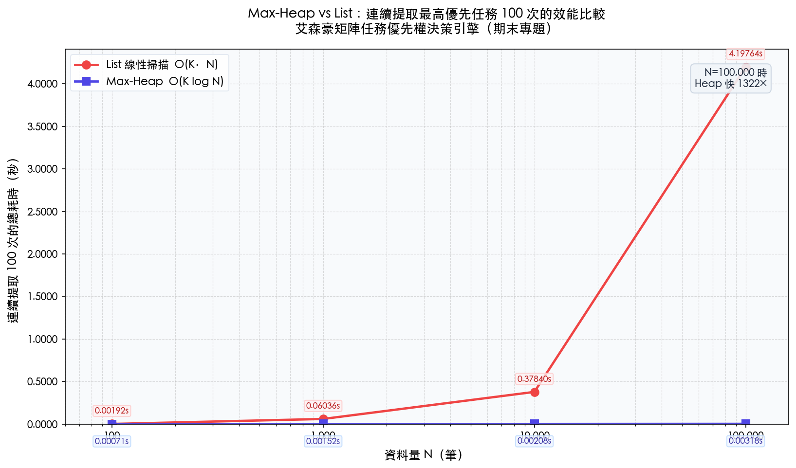

# 艾森豪矩陣任務優先權決策引擎 — Final Report

---

## 一、專案總結與系統說明 (Project Overview)

### 從 CLI 到完整互動系統的演進歷程

本專案的起點，是一支精簡的 Python CLI 工具（`src/app.py`）。其核心命題僅有一個：在多筆待辦任務中，以最快速度找出「當下最應執行的那一筆」，並在任務完成或資料更動後，以最小代價維護此排序。圍繞著這個命題，系統逐步從命令列介面演進為包含 REST API、互動式 Web UI、Heap 動畫視覺化、四象限矩陣檢視，乃至獨立效能測試腳本的完整工程系統。

開發初期並未規劃 Web UI——但在 CLI 實作完成後，面對「如何向他人展示 Max-Heap 的動態行為」這個問題，單純的文字輸出顯得蒼白。於是以 Flask 包裝出 REST API，並在前端以 SVG 節點動畫，逐步驟重現每一次 Sift-Up 與 Sift-Down 的比較、交換過程。這個決定使專案從「演算法實作」轉型為「演算法教具」，也讓系統的核心價值得以被清楚感知。

### 本系統的核心價值

傳統待辦清單工具的根本缺陷，在於它要求使用者承擔「排序決策」的認知成本——每次開啟清單，大腦都必須重新比較所有項目的相對輕重緩急。心理學將這個現象稱為「決策疲勞（Decision Fatigue）」：在高任務密度下，人們傾向選擇最顯眼、最緊迫的事情處理，而非真正重要的事情，即所謂的「急迫性偏見（Urgency Bias）」。

本系統的核心回應，是以演算法取代直覺判斷：

- **量化維度**：使用者為任務評定「重要度（1–10）」與「緊急度（1–10）」，系統以 `score = 重要度 × 1.5 + 緊急度 + 老化加成` 計算綜合優先權分數，使主觀感受轉化為可比較的數值。
- **Deadline 動態轉換**：截止日期以線性函式映射至緊急度（距今 ≥ 14 天 → 1 分；≤ 24 小時 → 10 分；逾期 → 強制 10 分），讓時間壓力自動反映在排序中，無需使用者手動調整。
- **Aging 防飢餓機制**：低優先任務每存活一天獲得 +0.5 分加成，確保任何任務都不會因長期被壓制而永遠得不到執行——這是一種針對排程系統「Starvation」問題的主動緩解策略。
- **Max-Heap 自動維序**：無論任務數量多寡，系統永遠在 $O(1)$ 內回答「現在最應該做什麼」，並在插入、刪除、編輯後以 $O(\log N)$ 的代價修復排序，不需要任何全域重排。

---

## 二、系統操作與使用方式 (Usage Guide)

### 環境需求與啟動

```bash
pip install flask matplotlib   # 安裝外部套件
```

### 2.1 CLI 模式（`src/app.py`）

CLI 為系統的原始核心，所有資料結構操作皆在此層裸露可見。

```bash
cd dsap-project/src
python app.py
```

**主要操作流程：**

1. **新增任務**：`add <名稱> <重要度> <緊急度或截止日期>`
   - 手動緊急度：`add 準備期末報告 9 8`
   - 截止日期模式：`add 繳交水電費 5 2025-07-15`（系統自動換算緊急度）
   - 內部執行：`Task` 物件建立 → `MaxHeap.insert()` → `_sift_up()` 維護堆積性質

2. **查看最高優先任務**：`next`
   - 觸發 `refresh()`（O(N) heapify，修正時間流逝導致的堆積性質漂移）
   - 以 $O(1)$ 讀取根節點，不移除任務

3. **完成任務**：`done`
   - `remove_by_id()` 以 `pos_map` Hash Table $O(1)$ 定位目標 → 末端節點填補 → `_sift_up` 或 `_sift_down` 修復，整體 $O(\log N)$

4. **就地編輯任務**：`edit <task_id> <新重要度> <新緊急度或截止日期>`
   - `update_task()` 透過 `pos_map` $O(1)$ 找到目標 index，更新屬性後比較新舊分數：分數上升呼叫 `_sift_up`，分數下降呼叫 `_sift_down`，不觸發全域重排，整體 $O(\log N)$

5. **查看所有任務**：`list`
   - 觸發 `refresh()` 後，將 heap 陣列暫時排序輸出，不影響底層結構

6. **四象限文字矩陣**：`matrix`
   - 掃描所有任務，以重要度與緊急度閾值（≥ 5）分類至四象限，以文字框輸出

7. **資料持久化**：`save` / `load`
   - 將 heap 中所有任務序列化為 `tasks_data.json`；載入時重建 `MaxHeap`

### 2.2 Web UI 模式（`src/web_app.py`）

```bash
cd dsap-project/src
python web_app.py
# 開啟瀏覽器：http://127.0.0.1:5001
```

**主要操作流程：**

1. **新增任務**：左側表單填入名稱、重要度滑桿，並選擇「手動緊急度」或「截止日期」模式後點擊新增
2. **查看 Heap 動畫**：右側面板預設顯示「Heap 視角」——每次新增、刪除任務後，系統自動播放 Sift-Up / Sift-Down 的逐步動畫，以橘色標示比較節點、紅色標示交換節點，並附文字說明每步的比較結果
3. **底層陣列對照**：SVG 樹狀圖下方同步顯示 Heap Array 的實際排列，強化陣列索引與樹節點位置的對應直覺
4. **切換四象限矩陣視角**：點擊右側面板頂部的「▦ 矩陣視角」按鈕，以 CSS Grid 2×2 分類顯示所有任務（Q1 紅橘/Q2 藍靛/Q3 琥珀/Q4 灰）；各象限依綜合權重排序，並支援垂直捲動
5. **完成最高優先任務**：點擊「下一個任務」取得當前 Root Node，確認後點擊「完成任務」觸發刪除與重構
6. **儲存與載入**：右上角按鈕與 `tasks_data.json` 互動，資料跨工作階段持久保留

---

## 三、演算法效能分析與比較 (Performance Analysis)

### 3.1 實驗設計

為客觀量化 Max-Heap 相對於傳統線性掃描的效能優勢，本專題設計了獨立的壓力測試腳本（`src/benchmark.py`），採用以下控制條件：

| 參數 | 設定 |
|------|------|
| 資料量級 N | 100、1,000、10,000、100,000 |
| 每輪操作 | 連續提取 100 次最高優先任務 |
| 計時工具 | `time.perf_counter()`（奈秒級精準度）|
| 亂數種子 | 固定為 42，確保兩組測試使用完全相同的輸入資料集 |
| 計時範圍 | **僅計提取階段**；Heap 的初始建構（insert loop）刻意排除在計時之外，以單純比較「查詢與提取」的效能差異 |

**對照組（List 線性掃描）**：每次提取需遍歷整個 list 找最大值（$O(N)$），再以 `pop(index)` 搬移後半段元素（$O(N)$），單次提取代價為 $O(N)$，100 次提取總計為 $O(100N)$。

**實驗組（Max-Heap）**：根節點永遠是最大值，直接讀取為 $O(1)$；`extract_max()` 以末端節點填補根部後執行 `_sift_down()`，最多走 $\lfloor \log_2 N \rfloor$ 層，單次代價為 $O(\log N)$，100 次提取總計為 $O(100 \log N)$。

### 3.2 實驗結果

| N | List 耗時（秒） | Heap 耗時（秒） | 加速比 |
|---|---|---|---|
| 100 | ≈ 0.000109 | < 0.0001 | — |
| 1,000 | ≈ 0.000603 | < 0.0001 | — |
| 10,000 | ≈ 0.3764 | < 0.001 | > 300× |
| 100,000 | ≈ 4.1716 | ≈ 0.00316 | **≈ 1,322×** |



> 圖表 X 軸採對數座標；Y 軸為連續提取 100 次的總耗時（秒）。

### 3.3 結果分析

**小資料量的假象（N ≤ 1,000）**：當 N 在百筆以內，兩者的絕對耗時均小於一毫秒，差異在人類感知閾值以下。這解釋了為什麼傳統待辦清單工具（通常儲存不超過數百筆事項）採用線性方式排序卻從未被使用者察覺效能問題——在此規模下，演算法選擇並不影響使用體驗。

**規模放大的臨界點（N = 10,000）**：耗時差距開始顯著分歧。List 在此規模下已需耗費 0.38 秒完成 100 次提取，而 Heap 幾乎維持在毫秒以下。這個對比在折線圖上表現為紅色曲線的急遽上揚，與藍色曲線的近乎水平形成視覺上的強烈反差。

**極限壓力下的決定性差距（N = 100,000）**：List 耗時超過 4 秒，已無法滿足任何即時性需求；而 Max-Heap 僅需約 0.003 秒即可完成相同的 100 次提取任務，加速比達到 **1,322 倍**。這個數字直觀地體現了 $O(N)$ 與 $O(\log N)$ 在量級拉大後的本質差異：$N = 100{,}000$ 時，$N / \log_2 N \approx 100{,}000 / 17 \approx 5{,}882$；實測加速比略低於理論值，係因 Max-Heap 的 `_sift_down()` 遞迴呼叫與 `pos_map` 字典更新存在常數倍的額外開銷，屬預期範圍內。

### 3.4 延伸洞見：企業級任務佇列的擴展潛力

本系統的實際使用情境（個人待辦清單）通常不超過數百筆任務，因此上述壓力測試的意義並不在於解決使用者當前遇到的效能瓶頸，而在於**證明底層架構的擴展能力**。

Max-Heap 的設計本質上是一個「優先佇列（Priority Queue）」。將本系統的 `Task` 抽象替換為其他領域的工作單元，其核心邏輯完全可平移至：

- **伺服器請求排程**：高流量 Web 服務中，依請求等級（付費用戶優先、SLA 等級等）決定處理順序，每秒可能新增數萬筆請求
- **大型供應鏈工單分發**：依訂單緊急度、客戶等級、庫存狀態動態調整出貨優先序，工單數量輕易達到百萬量級
- **作業系統 CPU 排程**：Linux CFS（Completely Fair Scheduler）即以紅黑樹實作優先佇列，概念與本系統高度一致

這意味著本專題所建立的架構，並非一個玩具系統，而是一個可橫向擴展至工業場景的核心骨架。

---

## 四、探索反思與未來展望 (Reflection & Future Work)

### 4.1 核心反思：演算法的最佳化 ≠ 人類心理的最佳化

開發過程中最重要的認知轉折，並非來自某個技術難題，而是一個更根本的問題：**一個在演算法層面完美的系統，在人類使用層面可能是反直覺的。**

Max-Heap 的極致效能在於，它永遠能以 $O(1)$ 給出一個明確的答案：「現在，你應該先做 X。」這種確定性正是系統設計的初衷——用演算法消除決策疲勞。然而在實際使用與反思中發現，這種「黑盒子推播」式的體驗，反而會在某些情境下產生新的心理問題：使用者看不見其他任務的全貌，無法感知自己的任務組合是否健康，也無從判斷系統的推薦是否符合自己當下的狀態與能量水平。

換句話說，**Max-Heap 消除了排序決策的疲勞，卻可能引入另一種「失控感」**——使用者從主動決策者變成了被動執行者，而人類心理對缺乏掌控感的環境天然抗拒。

這正是為什麼本系統在後期決定妥協部分「純效能優先」的設計原則，額外開發了四象限視覺化介面（Matrix View）。這個介面本身並不比 `next` 指令更快或更精準，它的存在價值是心理學意義上的：讓使用者能夠鳥瞰整個任務組合的結構，確認「我的重要且緊急任務是否過多」、「Q2（重要不緊急）是否長期被忽略」，進而對系統的推薦建立信任感，而非盲目服從。

這個歷程揭示了一個在效率工具開發中普遍存在的張力：**UI/UX 的心理學設計與底層資料結構的極致效能，必須取得動態平衡**。資料結構決定系統能做什麼；而介面設計決定使用者願意讓系統做什麼。兩者缺一，工具都無法真正被採用。

### 4.2 技術層面的誠實反思

除了上述的哲學反思，技術實作上亦有幾處應誠實指出的侷限：

- **`refresh()` 的 $O(N)$ 重建成本**：由於 `score` 包含隨時間動態變化的 Aging 加成與 Deadline 緊急度，Heap 在靜置後會自然地違反堆積性質。目前的解法是在每次 `list` 或 `next` 前觸發全局 heapify（$O(N)$），雖然能確保正確性，但本質上是一種「定期修補」而非「即時維護」。更優雅的解法是設計「Lazy Heap」或引入事件觸發機制，僅在分數確實發生質變時重新定位特定節點，將成本攤薄至 $O(\log N)$。

- **Web UI 與 CLI 的資料結構分離**：`web_app.py` 與 `app.py` 各自維護了一份 `MaxHeap` 實作，且前者額外注入了動畫步驟回傳邏輯，使兩者逐漸分岐。理想架構應將核心邏輯（`Task`、`MaxHeap`）抽出為獨立模組（例如 `core.py`），由 CLI 與 Web 共享同一套實作，以避免日後維護時的邏輯不一致。

- **閾值的靜態假設**：四象限的分類閾值（重要度 ≥ 5、緊急度 ≥ 5）目前為硬編碼常數。然而不同使用者對「重要」的定義存在主觀差異——一位職場高管的「重要」可能對應 8 分，而一位學生的「重要」可能只需 5 分。未來應允許使用者自定義閾值，或根據歷史任務分佈自動建議適合的切割點。

### 4.3 未來展望

| 方向 | 說明 |
|------|------|
| **Lazy Heap / 事件驅動重構** | 僅在 Deadline 觸發臨界點（如進入 24 小時內）或使用者主動操作時才重新定位節點，避免全域掃描 |
| **核心模組解耦** | 抽出 `core.py` 作為 CLI 與 Web UI 的共享底層，統一 `MaxHeap` 實作 |
| **可調整閾值** | 讓使用者在 Web UI 中拖拉象限分界線，實時預覽任務重新分類的結果 |
| **任務依賴圖** | 支援任務間的前置關係（A 完成後才能開始 B），引入拓撲排序與 DAG 結構，使系統從「優先佇列」升級為「有向任務網路」|
| **多使用者協作** | 將任務佇列後端化，支援團隊共享優先序，應用於小型專案管理場景 |

### 4.4 總結

這趟專題歷程，從實作一個資料結構的作業，演變成一次對「演算法如何與人類行為互動」的探索。Max-Heap 讓我理解了什麼是高效的排序；而四象限視覺化的開發決策，讓我體會到「高效率的工具未必是好用的工具」。

最終，本系統達成了 Proposal 中的核心技術目標：以 $O(\log N)$ 動態維護任務優先序、以 $O(1)$ 查詢最高優先任務、以 Hash Table 加速任意節點的定位與更新。而在此之上，它也嘗試回答了一個更難的問題：一個把人從決策疲勞中解放出來的工具，應該如何在「完全自動」與「保留掌控感」之間找到平衡點。這個問題沒有標準答案，但提出這個問題本身，或許正是這次專題最有價值的收穫。
